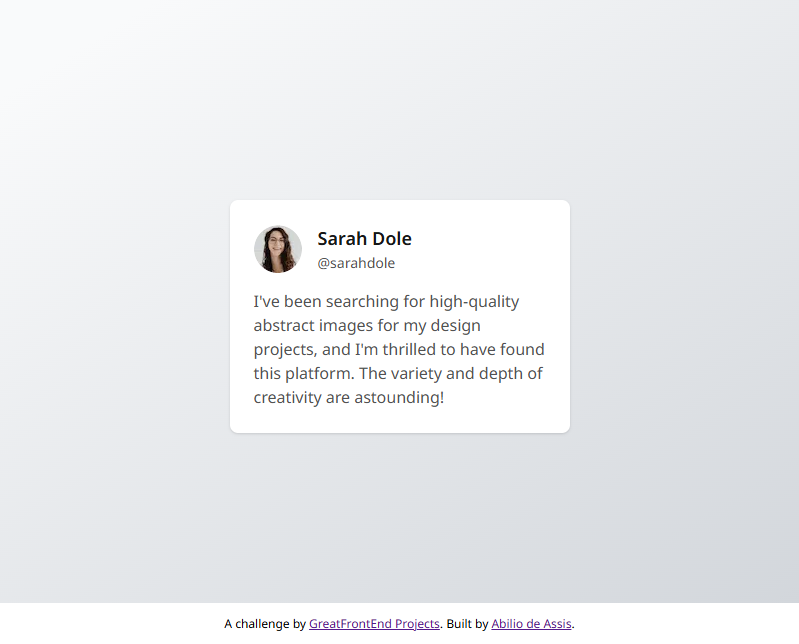

# Great Frontend Project – [Testimonial Card]

This repository contains my solution for the **[Testimonial Card]** from [Great Frontend Projects](https://www.greatfrontend.com/projects).

## 📸 Preview

## 🚀 Live Demo

[View on Netlify](https://your-netlify-link.netlify.app)

## 🛠️ Built With

- HTML5
- CSS3 (BEM methodology)

## 💡 Key Learnings

- Practiced **semantic HTML** with `<main>`, `<article>`, `<header>`,`<footer>`, headings, and ARIA attributes.
- Reviewed **Flexbox** for layout and alignment.
- Applied **BEM methodology** for clean, reusable CSS.
- Learned how to **optimize images** with WebP, `srcset`, and `decoding="async"`.
- Improved understanding of **responsive design** using `min-width`, `max-width`.
- Followed **accessibility and performance best practices**.
